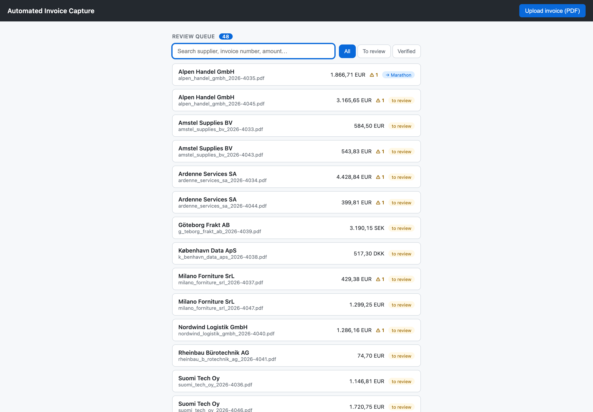
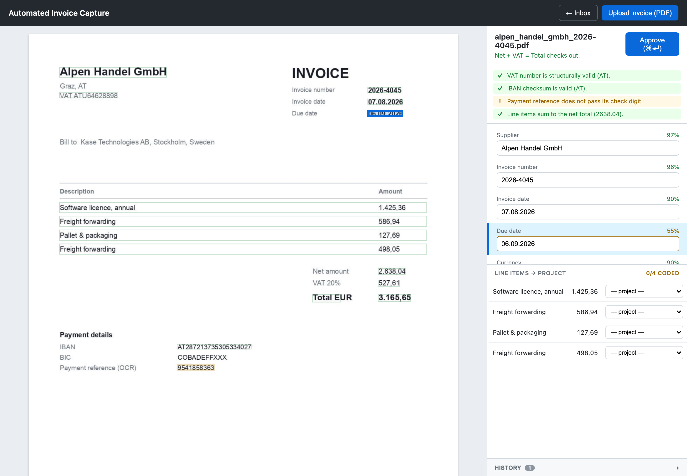
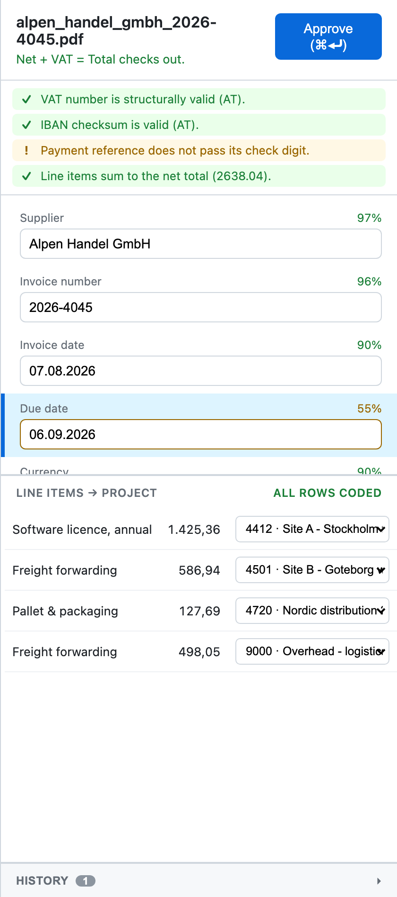
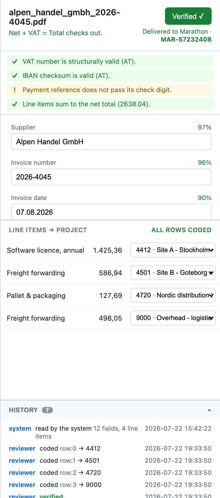

# Invoice Capture — User Guide

A short guide for reviewers: how to check, correct, code and approve invoices.

## What the software does

It reads each incoming supplier invoice and **proposes** the values it found.
You confirm or correct them, choose which project each line belongs to, and
approve. Approved invoices are sent on to the accounting system automatically.

**The software proposes; you decide.** Nothing is posted without your approval.

## Opening the application

Open the application in your browser (Chrome). You'll land on the **review
queue** — the list of invoices waiting for you.

## 1. The review queue

- Each row shows the **supplier**, the **amount**, and a **status**.
- A **⚠** marker means there's something on that invoice to look at.
- Use the **search box** to find an invoice by supplier, number, or amount.
- Use the tabs to show **All**, only those **To review**, or already **Verified**.
- **Click a row** to open it.

## 2. The verification screen

The invoice is on the **left**; the values the software read are on the
**right**. They are linked: click a value on the invoice and the matching field
is selected; select a field and its place on the invoice lights up.

Every value is drawn as a coloured box, and the colour tells you its status:

| Colour | Meaning |
|---|---|
| Green | Read with high confidence, passed all checks |
| Amber | Low confidence, or a warning — please look |
| Red | Failed a check, or is contradictory |
| Grey (dashed) | Expected but not found on the page |
| Blue | The field you are working on now |

At the top right, a **checks panel** summarises what the software verified — the
VAT and bank numbers, the payment reference, and whether the totals add up. Look
at anything **amber or red** first.

## 3. Check and correct

- **Green** — read with high confidence; glance and move on.
- **Amber** — low confidence or a warning; check it.
- **Red** — a check failed; fix it.
- **Grey (dashed)** — not found; type the value in.

To correct a value, click its field (or click its box on the invoice) and type.

The whole screen works from the keyboard:

| Key | Action |
|---|---|
| Tab | Move to the next field |
| Enter | Confirm and move on |
| ⌘ / Ctrl + Enter | Approve the whole invoice |

## 4. Code the lines to projects

Below the values is the list of invoice lines. Choose the **project** each line
belongs to from the dropdown. One invoice can be **split across several
projects** — code each line separately.

The lines must add up to the net amount; if they don't, you'll see a warning.
The header shows your progress (for example, "2/3 coded").

## 5. Approve

When everything looks right, press **Approve** (or ⌘ / Ctrl + Enter). The
invoice is recorded and sent to the accounting system. You'll see it confirm —
**"Delivered …"** with a reference number — and back in the queue it's marked
done.

## 6. See what happened (History)

Every invoice keeps a **History**: what the software first read, every change
you made (and when), the coding, and when it was sent on. Open the **History**
panel at the bottom of the screen to see it.

## Tips

- **Start with the ⚠ invoices** — those are the ones that need attention.
- You rarely need to type much: click the box on the invoice and the value is
  ready to overwrite.
- If a value looks wrong but its box sits on the right words, it's a quick edit.
  If the box is missing (grey), just type the value in.
- Corrections are remembered, so invoices from the same supplier get quicker to
  process over time.
